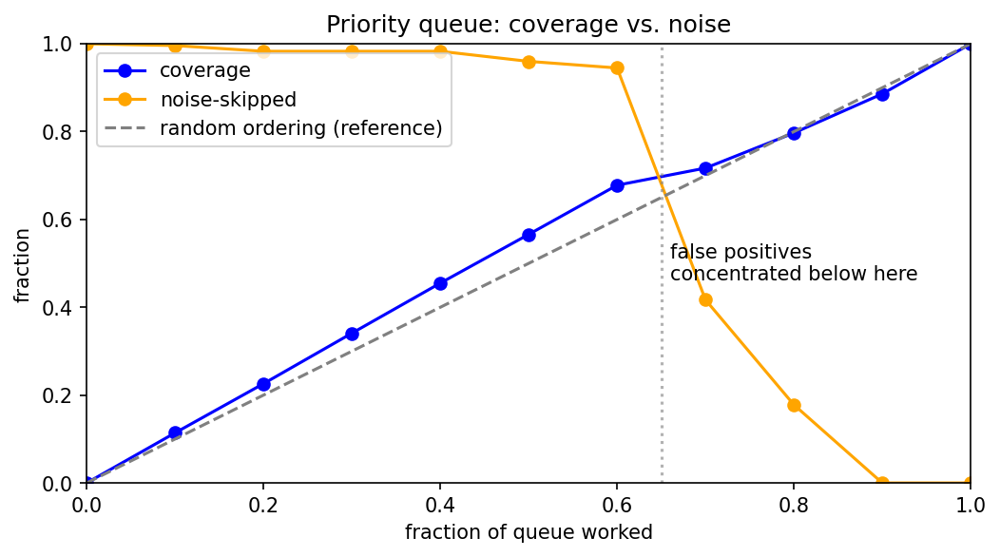
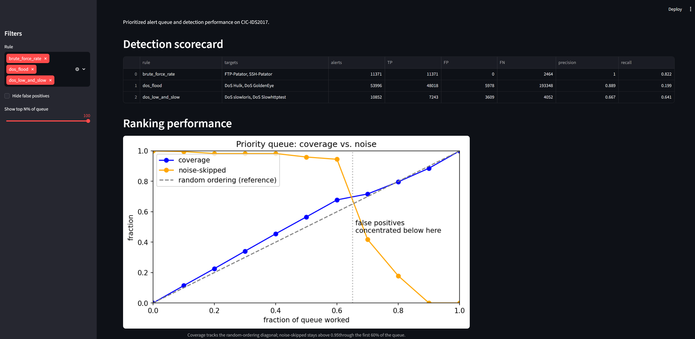
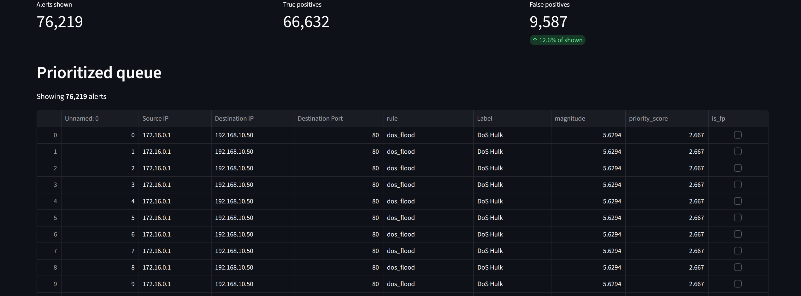

# SOC Alert Triage Analytics

> Turning 2.8M raw network flows into a prioritized, tuned alert queue — the way a SOC analyst actually works.


[](https://soc-alert-triage-analytics-mis5procputny5xj4rm47t.streamlit.app/)

🔗 **[Live dashboard](https://soc-alert-triage-analytics-mis5procputny5xj4rm47t.streamlit.app/)** — interactive triage queue, detection scorecard, and coverage analysis _(free tier so it may take ~30s to wake if idle)_

## Overview

Most intrusion-detection projects stop at "train a classifier, report accuracy." This one starts where a Security Operations Center's day actually begins: **too many alerts, not enough time.** Using the labeled CIC-IDS2017 network-flow dataset, I generate alerts from explainable detection rules, then analyze and tune that alert queue — measuring false-positive rates, ranking rules by signal-to-noise, and prioritizing what an analyst should look at first.

The deliverable is not a model. It's the **triage analytics layer** on top of detections, plus a dashboard that makes the queue actionable.

> **Build plan:** see [`PROGRESS.md`](PROGRESS.md) for the phase-by-phase roadmap and progress.

## Key results

- Built three explainable detection rules on labeled CIC-IDS2017 network flows, scored against ground truth, then tuned each and measured the effect.
- Improved recall across all three rules. Brute force 0.50 -> 0.82 (precision held at 1.00), low-and-slow 0.008 -> 0.64 via targeted, one knob at a time tuning.
- Isolated the low-and-slow bottleneck by per-condition analysis, and identified two attacks types (GoldenEye, Slowhttptest) the current features can't detect. 

## Before Tuning

The detection rules were tested against the **CIC-IDS2017** traffic. Baseline thresholds for these detection rules were created using Monday's benign data. The rules were tested against Tuesday (brute force) and Wednesday (DoS). These results were achieved before tuning the thresholds/rules.

| Rule | Targets | Alerts | TP | FP | FN | Precision | Recall |
|------|---------|-------:|---:|---:|---:|----------:|-------:|
| brute_force_rate | FTP-Patator, SSH-Patator | 6,886 | 6,886 | 0 | 6,949 | 1.000 | 0.498 |
| dos_flood | DoS Hulk, DoS GoldenEye | 31,421 | 31,145 | 276 | 210,221 | 0.991 | 0.129 |
| dos_low_and_slow | DoS slowloris, DoS Slowhttptest | 101 | 42 | 59 | 11,253 | 0.416 | 0.004 |

### Per-attack breakdown

The rule level recall shows a variation between each attack type. Notice that most are visible. Yet for the flood rules, **DoS Hulk** carries it almost entirely whereas **DoS GoldenEye** is close to being undetectable.

| Rule | Attack | TP | Total | FN | Recall |
|------|--------|---:|------:|---:|-------:|
| brute_force_rate | FTP-Patator | 3,978 | 7,938 | 3,960 | 0.501 |
| brute_force_rate | SSH-Patator | 2,908 | 5,897 | 2,989 | 0.493 |
| dos_flood | DoS Hulk | 31,145 | 231,073 | 199,928 | 0.135 |
| dos_flood | DoS GoldenEye | 0 | 10,293 | 10,293 | 0.000 |
| dos_low_and_slow | DoS slowloris | 42 | 5,796 | 5,754 | 0.007 |
| dos_low_and_slow | DoS Slowhttptest | 0 | 5,499 | 5,499 | 0.000 |

### Findings Pre-tuned

All three rules showcased a high precision while also displaying a low recall before tuning. The thresholds were initially set to be highly conservative, being able to correctly detect attacks but each rule missed a majority of its attacks.

- **Brute Force** achieved a near perfect precision while capped at *50%* recall. This is a direct artifact of the candidate packet count filter.

- **Flood** threshold was initially set too high and the results from this is a high precision and a low recall. **DoS Hulk** was only identified *13.5%* of the time and **DoS GoldenEye** was basically invisible with a *0.1%* effectively being missed.

- **Low and Slow** started weak on both axes (precision 0.42, recall 0.004). Its duration threshold, derived from benign traffic's extreme tail, excluded nearly every real slow attack.

## After tuning

Each rule has one primary threshold driving its recall. I adjusted them one
at a time, re-scored, and recorded the effect. The goal was to recover recall
without collapsing precision.

| Change | Rule | Before (P / R) | After (P / R) | Δ Recall |
|--------|------|:--------------:|:-------------:|:--------:|
| Loosened candidate packet-count filter | brute_force_rate | 1.000 / 0.498 | 1.000 / 0.822 | +0.324 |
| Lowered flow packet-rate threshold | dos_flood | 0.991 / 0.129 | 0.889 / 0.199 | +0.070 |
| Loosened throughput threshold | dos_low_and_slow | 0.416 / 0.004 | 0.667 / 0.641 | +0.633 |

### What changed and why

- **Brute force —** After loosening the candidate filter (MAX_FWD_PACKETS 8 -> 20) the recall rate nearly doubled thus confirming that the count filter was discarding nearly half of every attack before the rate rule ran. Loosening the candidate filter came at a zero precision cost.
- **Flood —** The packet-rate threshold was lowered (99.5th->90th percentile of benign.) This was able to recover some of the Hulk coverage as a small dip in precision but ultimately it revealed the feature's limit rather than improving.
- **Low-and-slow —** First the throughput threshold was loosened (bytes/s p05 -> p25, a ~40x wider bar) and no improvement in recall. This null result lead to dissecting each of the rules and conditions by individual pass-rate. The **flow duration** was revealed to be the true bottleneck: only 71 of 11,295 slow-DoS flows cleared the benign derived 119 second threshold. This was due to CICFlowMeter fragments long connections into shorter flow records. By lowering the duration threshold to the benign median recovered recall 160-fold.

### Findings After Tuned

- **Brute force was throttled by its own filter** — one change nearly doubled
  recall at no precision cost. FTP-Patator reached near-perfect recall (1.000);
  SSH-Patator lagged at 0.582, pointing to the rate threshold as the next lever.
- **Two attacks resist the current feature set.** DoS GoldenEye stays at 0.000
  recall — it isn't a per-flow packet-rate flood, so no threshold on that feature
  will catch it; it needs a different signal entirely.
- **DoS recall gains came at a precision cost** (flood 0.99 → 0.89, slow 0.42 →
  0.67) — a real tradeoff, not a clean win.
- **Overall:** conservative thresholds gave high precision but poor recall;
  targeted per-rule tuning improved recall across all three rules while
  surfacing attack types the current features can't detect.

## Triage: prioritizing the alert queue

Detection produces alerts; triage decides what an analyst looks at first. This layer ranks the full alert set into a prioritized queue and measures whether that ranking actually front-loads the real attacks.

### Priority score

Each alert is scored on two levels:

- **Tier (severity × confidence)** — a per-rule weight. Severity is assigned by impact (DoS = 3, brute force = 1); confidence is the rule's measured precision from the scorecard. This orders the *rules* against each other.
- **Magnitude (within tier)** — how far each alert exceeded its rule's threshold, as an exceedance ratio. This orders alerts *within* a tier.

The queue is sorted by tier, then magnitude. Resulting tier order:

| Rule | Severity | Confidence | Tier |
|------|:--------:|:----------:|:----:|
| dos_flood | 3 | 0.889 | 2.667 |
| dos_low_and_slow | 3 | 0.667 | 2.001 |
| brute_force_rate | 1 | 1.000 | 1.000 |

Confidence is drawn directly from the tuned scorecard, so the ranking stays in sync with measured rule performance.

### Does the ranking work? Top-N% coverage

Walking down the sorted queue, at each cutoff: what fraction of true attacks is captured (**coverage**), and what fraction of false positives is avoided by not working the rest (**noise skipped**)?



*Coverage tracks the random-ordering diagonal whereas within-tier ranking doesn't concentrate true positives, but noise-skipped stays above 0.95 through the first 60% of the queue, showing the ranking pushes false positives to the bottom.*

| Top N% of queue | Coverage retained | Noise skipped |
|:---------------:|:-----------------:|:-------------:|
| 10% | 0.113 | 0.992 |
| 20% | 0.227 | 0.990 |
| 30% | 0.338 | 0.967 |
| 40% | 0.453 | 0.967 |
| 50% | 0.565 | 0.955 |
| 60% | 0.680 | 0.953 |
| 70% | 0.721 | 0.443 |
| 80% | 0.797 | 0.178 |
| 90% | 0.886 | 0.000 |
| 100% | 1.000 | 0.000 |

### Findings

- **The ranking concentrates false positives at the bottom of the queue.** Noise skipped stays above 0.95 through the first 60% of the queue, then falls off a cliff (0.95 → 0.44 → 0.18) as the false positives arrive in a block near the end. An analyst working top-down clears the first 60% of alerts encountering under 5% false positives which is the core triage benefit.
-- **Rule overlap inflates the flood queue.** The flood rule fires on ~5,100 benign flows and ~870 slow-DoS flows (slowloris and Slowhttptest) that exceed its packet-rate threshold. Flows already caught by other rules. This overlap, a side effect of lowering the flood threshold during tuning, is a concrete source of the queue noise the ranking pushes to the bottom.
- **Coverage tracks near-linear**, meaning within-tier ranking does not concentrate true positives. Working the top 40% captures ~45% of attacks which is barely better than arbitrary ordering.
- **This is a feature limitation, not a ranking one — proven by elimination.** Single-feature magnitude produced a diagonal curve but left many alerts tied. A composite of three exceedance signals (packet rate, byte rate, forward packets) broke every tie and made the ordering fully deterministic which is yet the coverage curve did not move. That rules out "ties were hiding a good ranking": the flow features simply do not separate a real flood from a benign flow that tripped the rule, so no threshold-distance ranking can order them by likelihood of being a true positive.

### What would improve it

Bending the coverage curve requires a per-alert signal that correlates with true-vs-false-positive which a detection improvement, not a ranking one. The natural next step is a lightweight per-alert confidence model (a classifier over flow features) to score alerts within a tier, replacing threshold-distance magnitude. Noted as future work.

## Dataset

**CIC-IDS2017** — Canadian Institute for Cybersecurity ([source](https://www.unb.ca/cic/datasets/ids-2017.html))

This project uses the **`GeneratedLabelledFlows`** files (not the ML-only CSVs), because the triage analysis needs `Source IP` and `Timestamp` to aggregate alerts per source over time.

- **Tuesday** — Brute force (FTP-Patator :21, SSH-Patator :22)
- **Wednesday** — DoS (Hulk, GoldenEye, slowloris, Slowhttptest)
- **Monday** — benign only; used as the "normal" baseline for thresholds

> Data files are not committed to this repo (see `.gitignore`). Download them from the source above.

## Approach

1. **Clean** — normalize column names (raw files have leading spaces), handle `inf`/`NaN`, drop the duplicate `Fwd Header Length.1` column.
2. **Baseline** — profile Monday's benign traffic; compute per-port percentiles for the features the rules use.
3. **Detect** — apply explainable rules to generate alerts (see below).
4. **Score** — compare alerts to ground-truth labels for per-rule TP / FP / FN, precision, recall.
5. **Triage** — analyze the alert queue: volume over time, FP rate per rule, noisiest sources, priority ranking.
6. **Dashboard** — surface it all in Streamlit.

## Detection rules

| Rule | Attack | Key signal |
|------|--------|-----------|
| Brute force | FTP/SSH Patator | Attempt **rate per source** to an auth port (not any single flow) |
| DoS flood | Hulk, GoldenEye | High packet rate on port 80 |
| DoS low & slow | slowloris, Slowhttptest | Long-lived flow + near-zero throughput |

All thresholds are derived from the benign baseline (percentile-based), not hardcoded. See `src/rules.py`.

## Dashboard

An interactive Streamlit dashboard turns the static analysis into a tool an analyst can actually work. It reads the pipeline's saved outputs: the prioritized queue, the scorecard, and the coverage figure and presents them with live filtering.





**What it shows:**

- **Detection scorecard** — per-rule precision and recall at a glance
- **Ranking performance** — the coverage-vs-noise curve
- **Prioritized queue** — every alert in priority order, with live summary metrics (alerts shown, true positives, false positives, and current false-positive rate)

**Filters (sidebar):**

- **Rule** — show or hide each detection rule's alerts
- **Hide false positives** — collapse the queue to confirmed detections only
- **Top N% of queue** — work only the highest-priority slice

The dashboard computes nothing itself, it just reads the CSVs the pipeline produces, keeping presentation decoupled from analysis. Filters apply in sequence (rule → false positives → top N%), and the summary metrics recompute against whatever subset is currently shown.

### Run it

```bash
pip install -r requirements.txt
streamlit run dashboard/app.py
```

> Run from the directory containing the pipeline's output CSVs (`priority_queue.csv`, `results.csv`) and the `figures/` folder, so the app can find them.

## Repo structure

```
├── data/                 # raw flows (gitignored)
├── notebooks/
│   └── 01_baseline_eda.ipynb
├── src/
│   ├── clean.py          # column cleanup + inf/NaN handling
│   ├── baseline.py       # per-port percentile thresholds from Monday
│   ├── rules.py          # brute-force + DoS detection rules
│   ├── score.py          # TP/FP/FN vs. labels
│   └── triage.py         # alert-queue analytics
├── dashboard/
│   └── app.py            # Streamlit app
├── figures/
├── requirements.txt
└── README.md
```

## How to run

```bash
# 1. install
pip install -r requirements.txt

# 2. drop the GeneratedLabelledFlows CSVs into data/

# 3. build baseline thresholds from Monday
python src/baseline.py

# 4. run rules -> alerts -> scoring
python src/rules.py
python src/score.py

# 5. triage analytics + dashboard
python src/triage.py

# 6. Run Streamlit
streamlit run dashboard/app.py
```

## Skills demonstrated

- **Detection engineering** — authoring and evaluating explainable rules
- **Alert triage & tuning** — FP-rate analysis, signal-to-noise ranking, prioritization
- **Data analytics** — EDA, time-series aggregation, class-imbalance handling (pandas)
- **SIEM / dashboarding** — Streamlit
- **Security-domain fluency** — TP/FP reasoning, attack taxonomies, MITRE ATT&CK

## MITRE ATT&CK mapping

| Attack | Technique |
|--------|-----------|
| FTP-Patator, SSH-Patator | T1110 — Brute Force |
| DoS Hulk, DoS GoldenEye | T1499.002 — Endpoint DoS: Service Exhaustion Flood |
| DoS slowloris, DoS Slowhttptest | T1499.003 — Endpoint DoS: Application Exhaustion Flood |

## Future work

- Extend to Thursday (web attacks: SQLi, XSS) and Friday (DDoS, port scan, botnet)
- Group related alerts into incidents ("campaign view")
- Add mock SLA metrics (mean time to acknowledge / triage)

## Disclaimer

For research and educational purposes only.

## License

MIT — see [LICENSE](LICENSE).
